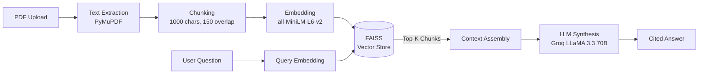

# DocMind — RAG-Based Personal Knowledge Assistant

> **Chat with your PDFs.** Upload any document, ask questions in natural language, and get precise, source-cited answers powered by Retrieval-Augmented Generation.

[](https://python.org)
[](https://fastapi.tiangolo.com)
[](https://nextjs.org)
[](https://docker.com)
[](https://pytest.org)
[](LICENSE)

---

## What is DocMind?

DocMind is a local-first, privacy-respecting RAG (Retrieval-Augmented Generation) assistant that lets you have a conversation with your PDF documents. Unlike cloud-based tools, your data never leaves your machine. Embeddings are stored locally in FAISS, and only the relevant context is sent to the LLM for answer synthesis.

### Key Features

| Feature | Description |
|---|---|
| **Semantic Retrieval** | Finds contextually relevant passages, not just keyword matches |
| **Source Citations** | Every answer links back to exact page and paragraph |
| **Multi-turn Chat** | Follow-up questions maintain conversation context |
| **Local Vector Store** | FAISS index — your data never leaves your machine |
| **Groq LLaMA 3.3 70B** | Fastest open-weight LLM — answers in under 2 seconds |
| **Universal PDF Support** | Research papers, contracts, manuals, reports — anything goes |

---

## Architecture



---

## Tech Stack

### Backend
- **Framework:** FastAPI + Uvicorn
- **Embedding Model:** Sentence Transformers (`all-MiniLM-L6-v2`)
- **Vector Database:** FAISS (local, flat L2 index)
- **PDF Parsing:** PyMuPDF (fitz)
- **LLM Provider:** Groq API (LLaMA 3.3 70B Versatile)
- **Testing:** Pytest (25 unit tests)

### Frontend
- **Framework:** Next.js 16 (React 19)
- **Animations:** Framer Motion
- **Styling:** Tailwind CSS
- **HTTP Client:** Axios

---

## Project Structure

```
DocMind/
├── backend/
│   ├── main.py                  # FastAPI application (upload + ask endpoints)
│   ├── requirements.txt         # Python dependencies
│   ├── Dockerfile               # Backend container
│   ├── conftest.py              # Pytest shared fixtures
│   ├── rag/
│   │   ├── __init__.py
│   │   ├── ingest.py            # PDF → chunks → embeddings → FAISS
│   │   └── ask.py               # Question → retrieval → LLM → answer
│   ├── tests/
│   │   ├── __init__.py
│   │   ├── test_chunking.py     # 6 tests — text chunking logic
│   │   ├── test_ingest.py       # 7 tests — PDF ingestion pipeline
│   │   ├── test_ask.py          # 6 tests — Q&A pipeline
│   │   └── test_api.py          # 6 tests — FastAPI endpoints
│   ├── uploads/                 # Stored PDFs (gitignored)
│   └── vectorstore/             # FAISS index + metadata (gitignored)
├── frontend/
│   ├── app/
│   │   ├── layout.tsx           # Root layout with metadata
│   │   ├── page.tsx             # Main UI — upload, chat, features
│   │   └── globals.css          # Global styles
│   ├── package.json
│   └── Dockerfile               # Frontend container
├── docker-compose.yml           # One-command deployment
├── .env.example                 # Environment variable template
├── .gitignore
└── README.md                    # ← You are here
```

---

## Quick Start

### Prerequisites
- Python 3.11+
- Node.js 20+
- A free [Groq API key](https://console.groq.com)

### 1. Clone the repository

```bash
git clone https://github.com/Surya270106/RAG-based-personal-knowledge-assistant.git
cd RAG-based-personal-knowledge-assistant
```

### 2. Set up environment variables

```bash
cp .env.example .env
# Edit .env and add your GROQ_API_KEY
```

### 3. Start the Backend

```bash
cd backend
pip install -r requirements.txt
uvicorn main:app --reload --port 8000
```

The API will be available at `http://localhost:8000` (Swagger docs at `/docs`).

### 4. Start the Frontend

```bash
cd frontend
npm install
npm run dev
```

Open `http://localhost:3000` in your browser.

---

## Docker Quick Start

Run the entire stack with a single command:

```bash
# Copy and configure environment
cp .env.example .env
# Edit .env with your GROQ_API_KEY

# Launch both services
docker-compose up --build
```

| Service | URL |
|---|---|
| Frontend | http://localhost:3000 |
| Backend API | http://localhost:8000 |
| API Docs (Swagger) | http://localhost:8000/docs |

```bash
# Stop services
docker-compose down

# Stop and remove volumes
docker-compose down -v
```

---

## Testing

DocMind includes a comprehensive Pytest test suite with **25 tests** covering the full RAG pipeline:

```bash
cd backend
pip install -r requirements.txt
pytest tests/ -v
```

### Test Coverage

| Module | Tests | What's Covered |
|---|---|---|
| `test_chunking.py` | 6 | Text splitting, overlap, edge cases |
| `test_ingest.py` | 7 | PDF parsing, FAISS indexing, metadata |
| `test_ask.py` | 6 | Retrieval, LLM integration, chat history |
| `test_api.py` | 6 | Upload/Ask endpoints, validation, CORS |

```bash
# Run with coverage report
pytest tests/ -v --tb=short

# Run specific test file
pytest tests/test_chunking.py -v
```

---

## API Reference

### `POST /upload`

Upload a PDF document for indexing.

**Request:** `multipart/form-data`

| Field | Type | Description |
|---|---|---|
| `file` | File | PDF file to upload |

**Response:**

```json
{
  "message": "Uploaded successfully",
  "document_id": "550e8400-e29b-41d4-a716-446655440000",
  "chunks_indexed": 42
}
```

---

### `POST /ask`

Ask a question about your uploaded documents.

**Request:** `application/json`

```json
{
  "question": "What is the main conclusion?",
  "document_ids": ["550e8400-e29b-41d4-a716-446655440000"],
  "chat_history": [
    { "role": "user", "content": "Previous question" },
    { "role": "assistant", "content": "Previous answer" }
  ]
}
```

**Response:**

```json
{
  "answer": "Based on the document, the main conclusion is...",
  "sources": [
    {
      "filename": "research_paper.pdf",
      "page": 12,
      "chunk_text": "The findings demonstrate that..."
    }
  ]
}
```

---

## Environment Variables

| Variable | Required | Description |
|---|---|---|
| `GROQ_API_KEY` | Yes | API key from [Groq Console](https://console.groq.com) |

---

## Roadmap

- [ ] Multi-document chat (query across all uploaded docs)
- [ ] Streaming LLM responses (Server-Sent Events)
- [ ] Support for DOCX, TXT, and Markdown files
- [ ] Conversation persistence (save/load chat sessions)
- [ ] Hybrid search (BM25 + vector similarity)
- [ ] Deploy to cloud (Render / Railway / Vercel)

---

## Contributing

Contributions are welcome! Here is how:

1. Fork the repository
2. Create a feature branch: `git checkout -b feature/amazing-feature`
3. Commit your changes: `git commit -m 'Add amazing feature'`
4. Push to the branch: `git push origin feature/amazing-feature`
5. Open a Pull Request

---

## License

This project is open source and available under the [MIT License](LICENSE).

---

<p align="center">
  Built using FastAPI, FAISS, Sentence Transformers & Groq LLaMA 3.3
</p>
